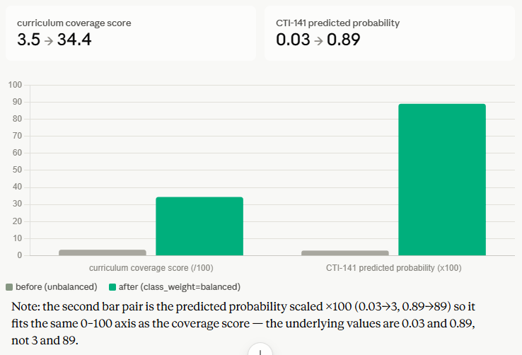

# Check-In 2 : Is It Getting Better

## Before-and-After Comparison

| Metric | Before | After |
|---|---|---|
| `cloud_platforms` curriculum coverage score | 3.5 / 100 | 34.4 / 100 |
| Predicted probability that CTI-141 ("Cloud & Storage Concepts") belongs to `cloud_platforms` | 0.03 | 0.89 |
| Positive training examples for `cloud_platforms` in the dataset | 1 of 74 documents (unchanged) | 1 of 74 documents (unchanged) |

The third row matters: the underlying data didn't change. The fix was in how the classifier handled that data.
# cloud_platforms Fix:  Before/After Data

## Chart

## Metrics

| Metric | Before | After |
|---|---|---|
| Curriculum coverage score (0–100 scale) | 3.5 | 34.4 |
| CTI-141 predicted probability (0–1 scale) | 0.03 | 0.89 |
| Positive training examples for this category | 1 of 74 documents | 1 of 74 documents (unchanged) |

## What changed

`class_weight="balanced"` was added to the `LogisticRegression` classifier in `apply_taxonomy.py`. No data changed — only how the classifier weighted the single positive example for this category during training.

## Note on the chart version

The visual chart shown in this conversation scales the predicted probability by ×100 (0.03 → 3, 0.89 → 89) so both metrics fit the same 0–100 axis for visual comparison. The actual predicted probability values are 0.03 and 0.89, not 3 and 89 — see the table above for the real values.

## 1. What changed since Check-In 1?

The AI agent (step 5 of the pipeline) got built and run end-to-end for the first time, before Check-In 1 it existed only as a design document with no code. During that build, the dashboard surfaced an anomaly: `cloud_platforms` was scoring 3.5/100 despite CTI-141 being a dedicated cloud course. The first attempted fix was expanding the taxonomy's keyword list for that category, on the assumption that the classifier just wasn't recognizing enough cloud-related vocabulary. That change was made, the pipeline was rerun, and the score didn't move at all, same 3.5/100.

## 2. Why the keyword expansion was expected to help?

Weak-labeling in this pipeline works by keyword matching: a course gets tagged as belonging to a category if its description contains any of that category's keywords. If a category was scoring near-zero, a thin keyword list would be the obvious first suspect, not enough terms to catch real cloud-related language across course descriptions and O*NET job task text.

## 3. Did it actually help, and how do I know?

No, verified directly, not just inferred from the unchanged score. Checking the actual weak-label output showed CTI-141 was already correctly tagged 1 for `cloud_platforms` before the keyword expansion, meaning the labeling step was never the problem. The real fault was downstream: checked the classifier's predicted probabilities per course and found CTI-141 was getting a probability of only 0.03 for `cloud_platforms` even though it was labeled 1 for that category. Traced the training data and found only 1 of 74 total documents was a positive example for that category: LogisticRegression, without class balancing, was suppressing the predicted probability of a rare class close to zero even on the one document that should have scored high.

The actual fix was adding `class_weight="balanced"` to the classifier. Rerunning with that change and checking the same per-course probability directly (not just the final aggregate score) showed CTI-141's predicted probability jump from 0.03 to 0.89, and the category's curriculum coverage score rise from 3.5 to 34.4. Both numbers were confirmed with a direct before/after run, not assumed from the code change alone.

## What's next

Run the agent's full LLM-generated report (step 5) with a real Anthropic API key rather than the templated fallback, and cross-check its written claims against the raw scored data, already done once, and the report's stated weakest categories matched the actual lowest scores exactly. Next planned step beyond that: get a second rater to review the taxonomy's keyword lists and category boundaries, since the whole classifier is still trained on a single author's weak labels with no inter-rater reliability check.
